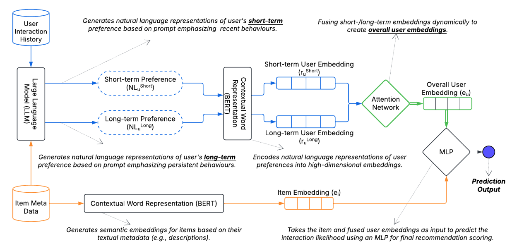
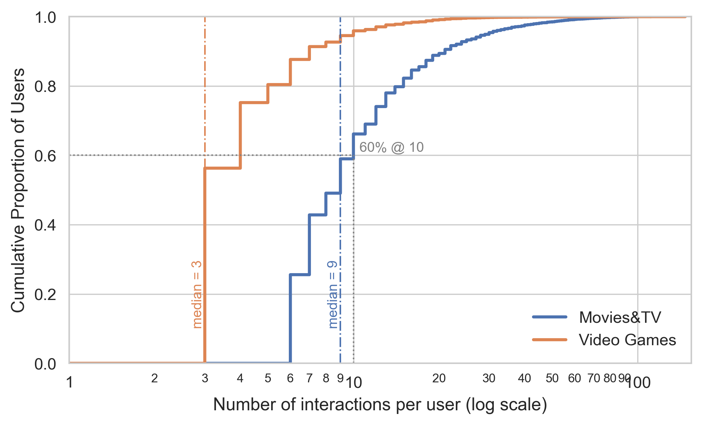
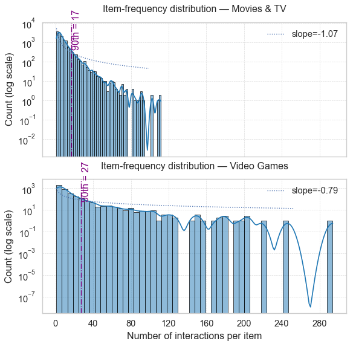
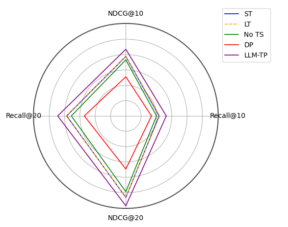
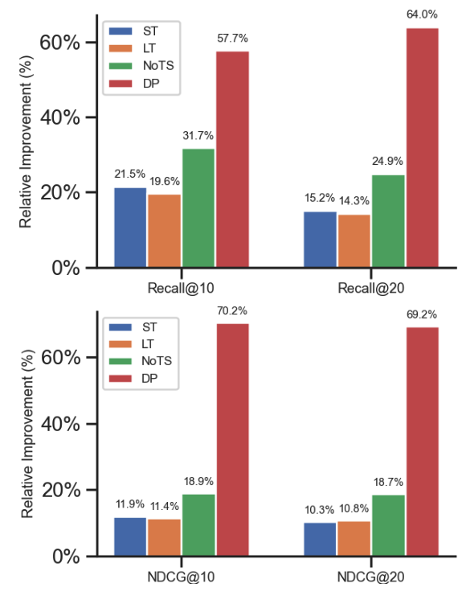

# Using LLMs to Capture Users’ Temporal Context for Recommendation

This repository contains the code, datasets, prompts, and experimental results associated with the paper:

**"Using LLMs to Capture Users’ Temporal Context for Recommendation"**

## ⭐ Project Overview

This paper presents an in-depth assessment of the efficacy of Large Language Models (LLMs) specifically for user profile generation within recommender systems. 

**Problem:** Accurate user preference modeling is paramount for effective recommender systems. However, traditional user profiling often struggles to capture the nuanced, dynamic nature of user preferences, particularly distinguishing between transient short-term interests and enduring long-term tastes. This limitation can lead to generalized user representations that inadequately reflect current intent or obscure semantic distinctions across diverse interests. The increasing adoption of recommender systems in dynamic environments also highlights a critical need for incorporating richer contextual information.

**Approach:** This work presents an in-depth assessment of Large Language Models (LLMs) for generating semantically enriched, time-aware user profiles. This approach investigates the degree of LLM effectiveness in capturing the dynamic of user context by disentangling short-term and long-term preferences. The controlled architectural framework employs LLMs to generate distinct natural language summaries for a user's recent (short-term) and historical (long-term) interactions. These temporally segmented textual profiles are then encoded into semantic embeddings using BERT and adaptively fused via an attention mechanism to form comprehensive, time-aware user embeddings. This aims to improve recommendation accuracy and inherently offers interpretability potential, aligning with the call for explainable Context-Aware Recommender Systems (CARS).

## 🔑 Key Contributions (as highlighted in the paper):
* **Analysis of LLM Capability for Dynamic Temporal Context Modeling:** Provides a systematic investigation into the degree of LLM effectiveness in capturing the dynamic of user context by disentangling short-term and long-term preferences from interaction histories.
* **Nuanced Performance Characteristics Across Contextual Landscapes:** Reveals that the effectiveness of LLM-driven profiling is notably contingent on the richness and dynamism of user interaction histories. Findings indicate superior performance in domains with extensive user activity and larger item catalogs (e.g., Movies&TV), whereas gains may be less pronounced or even marginal in sparser interaction environments (e.g., Video Games).
* **Validation of Contextual Components:** Ablation studies confirm the critical roles of LLM-based semantic summarization, explicit temporal separation, and adaptive fusion in enhancing user profiling for context-aware recommendations

## LLM-based Profile Generation

The user profiles (short-term and long-term textual summaries) were generated using GPT-4o-mini. We provide the exact prompts used for generation and a sample of the generated profiles.

### Prompts Used:
To ensure clarity and allow for replication, we provide summary versions of the prompts below. The full, exact prompt definitions are available in their respective files within the `prompts` directory.

**Short-Term Preference Prompt:** his prompt instructs the LLM to summarize a user's most recent interactions, focusing on immediate interests and temporary trends.

`"Summarize the user’s most recent interactions focusing on immediate interests and temporary trends."`

The complete prompt used is located in `prompts/prompt_short.txt`.

**Long-Term Prompt:** This prompt directs the LLM to analyze the user’s entire interaction history to identify stable, persistent preferences and overarching themes.

`"Analyze the user’s entire interaction history to identify stable, persistent preferences and overarching themes."`

The complete prompt used is located in `prompts/prompt_long.txt`.

**General Preferences (No TS) Prompt:** For the ablation study's "No TS" variant, a single prompt was used to instruct the LLM to generate a holistic user profile encompassing all interactions without temporal distinction. This variant highlights the value of temporal separation in our full model.

`"Summarize the user’s entire interaction history to create a single, comprehensive profile of their overall preferences and interests."`

The complete prompt used is located in `prompts/prompt_general.txt`.

### Sample Generated Profiles:

**Sample User Preference (Movies&TV)**

* **Short-Term:** `"The user recently favors heartwarming classics and romantic films with nostalgic tones, drawn to relationship-driven stories and gentle mysteries that offer emotional comfort."`
* **Long-Term:** `"The user has consistently preferred emotionally intense dramas and classic film noir, with a strong interest in morally complex, character-driven stories exploring the human condition." `
* **General (No TS):** `"The user generally enjoys emotionally rich and complex narratives, with a strong inclination towards classic cinema and a recent interest in heartwarming, comfort-oriented films."`

## Datasets

We use two datasets from the Amazon Product Reviews corpus, focusing on:
- **Movies & TV**
- **Video Games**

| Dataset | # Users | # Items | # Interactions |
|---------|---------|---------|----------------|
| Movies&TV | 10,000 | 14,420 | 202,583 |
| Video Games | 10,371 | 3,790 | 83,842 |

| Dataset | Mean Interactions | Median | Mode | Std Dev |
|---------|-------------------|--------|------|---------|
| Movies&TV | 11.79 | 9.00 | 6 | 9.80 |
| Video Games | 4.55 | 3.00 | 3 | 3.97 |

## Experimental Setup

- Framework: PyTorch
- LLM Model: GPT-4o-mini (for profile generation)
- Embedding Model: all-MiniLM-L6-v2 (384 dimensions)
- Optimizer: Adam
- Evaluation Metrics: Recall@K and NDCG@K (K = 10, 20)
- Temporal Data Splitting: 60% Train, 20% Validation, 20% Test
- Negative Sampling: 5 negative samples per positive interaction

## Results

Performance Comparison:

| Method      | Recall@10 (Movies) | NDCG@10 (Movies) | Recall@20 (Movies) | NDCG@20 (Movies) | Recall@10 (Games) | NDCG@10 (Games) | Recall@20 (Games) | NDCG@20 (Games) |
|-------------|--------------------|------------------|--------------------|------------------|------------------|----------------|------------------|----------------|
| Centric     | 0.0113 | 0.0191 | 0.0199 | 0.0269 | 0.0645 | 0.0532 | 0.0932 | 0.0649 |
| Popularity  | 0.0082 | 0.0145 | 0.0133 | 0.0191 | 0.0397 | 0.0324 | 0.0706 | 0.0453 |
| MF          | 0.0048 | 0.0085 | 0.0087 | 0.0124 | 0.0457 | 0.0370 | 0.0754 | 0.0491 |
| Temp-Fusion | 0.0118 | 0.0201 | 0.0207 | 0.0276 | 0.0693 | 0.0589 | 0.0982 | 0.0712 |
| **LLM-TP**  | **0.0132** | **0.0217** | **0.0223** | **0.0293** | **0.0665** | **0.0547** | **0.1021** | **0.0683** |

## Figures
- **Figure 1: Architectural Framework for Assessing LLM-Driven Temporal User Profiling**

  

- **Figure 2: ECDF of User Interactions per User (Movies & TV and Video Games)**

  

- **Figure 3: Item-Frequency Distribution Histograms (Movies & TV and Video Games)**

  

- **Figure 4: Radar Plot Comparing LLM-Driven Temporal User Profiling (LLM-TP) and Ablated Variants**

  

- **Figure 5: Relative Performance Gains Across Ablated Variants**

  

## Ablation Study

Performance of different variants on Movies&TV dataset:

| Experiment                 | Recall@10 | Recall@20 | NDCG@10 | NDCG@20 |
|----------------------------|-----------|-----------|---------|---------|
| Short-Term Only (ST)       | 0.0109 | 0.0193 | 0.0194 | 0.0266 |
| Long-Term Only (LT)        | 0.0110 | 0.0195 | 0.0195 | 0.0265 |
| General Preferences (NoTS) | 0.0100 | 0.0178 | 0.0183 | 0.0247 |
| Dot-Product Scoring (DP)   | 0.0084 | 0.0136 | 0.0128 | 0.0173 |
| **LLM-TP**                 | **0.0132** | **0.0223** | **0.0217** | **0.0293** |

## Conclusion

The study demonstrates that explicitly modeling temporal dynamics with LLM-based semantic profiling significantly improves recommendation performance over traditional and temporally-naive methods. Our results highlight the value of combining short-term and long-term user behaviors using rich textual summarization, offering new directions for personalized content-based recommendation.

## References

[//]: # (Relevant references can be found in the [paper]&#40;link-to-paper-or-arxiv&#41;. For major models and tools used:)
 Relevant references can be found in the paper. For major models and tools used:
- [PyTorch](https://pytorch.org/)
- [GPT-4 Technical Report](https://arxiv.org/abs/2303.08774)
- [SBERT - Sentence-BERT](https://arxiv.org/abs/1908.10084)

---

[//]: # (*For questions or collaborations, feel free to reach out!*)
